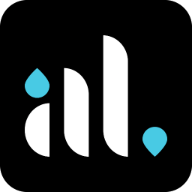

# Personal Website

Ariel Levi

> Welcome to my personal porfolio website repository! Continue through this repository to see the code, or view my finished work at [alevi22.github.io](https://alevi22.github.io).

## About the Project

In an effort to combine my passions for code, writing, and design, I created this personal portfolio website that showcases my experiences, accomplishments, and interests. Every aspect of the website was designed with several principles in mind:

-   **componentization** – to ensure consistency and effectiveness of code and design, as well as maintaining good design principles and software engineering practices
-   **flexibility** – so that the website can easily be updated with new experiences and accomplishments
-   **ease of use** – for website visitors to get to know me in the easiest way possible!

To meet these goals, each component—from the navigation bar to the showcase cards to the hero header—was built from scratch using [React.js](https://reactjs.org/), and all elements were styled using custom CSS.

## Project Timeline

Late 2020 to early 2021, with updates added continuously as necessary

## Feedback

I would love to hear any thoughts, suggestions, or ideas for improvement! Please contact me through my website to share!
