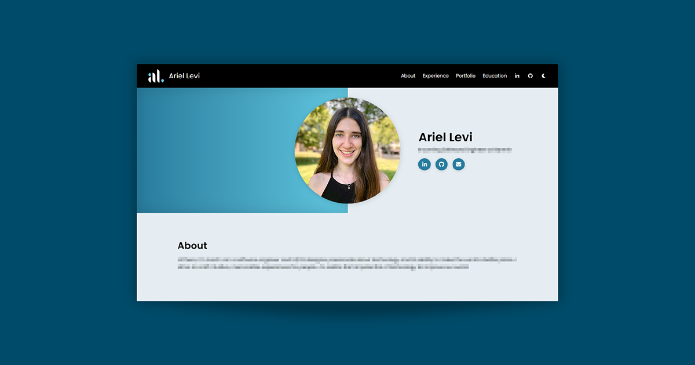

# Personal Portfolio Website

**Ariel Levi**

Welcome to the code repository for my personal portfolio website! Continue through this repository to look through the code, or view my finished work at **[ariellevi22.github.io](https://ariellevi22.github.io)**.

## About the Project

To combine my passions for code, writing, and design, I created this personal portfolio that showcases my experiences and accomplishments so far. I crafted every aspect of the portfolio with the goal of maintaining the flexibility, effectiveness, and simplicity of code and design.

## Development

For more technical details about the project, take a look at the [development documentation](/web-app/README.md).
